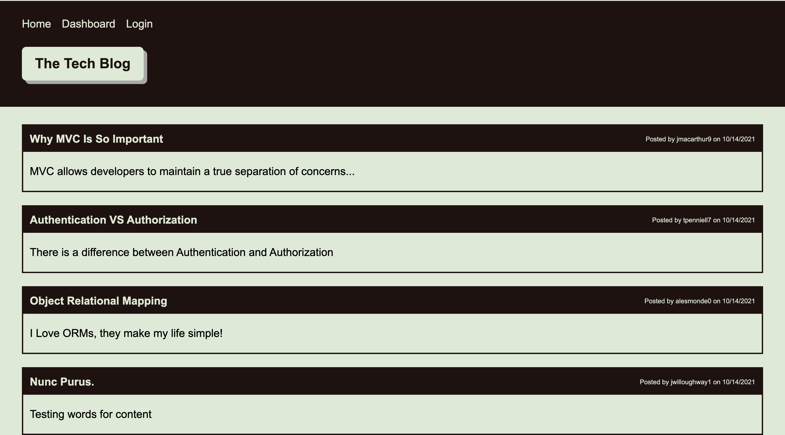

# Tech Blog Site
unlicensed

## Description
Blog website, where developers can publish their blog posts and comment on other developers’ posts as well.  
[project link]()

## Table Of Contents
* [Installation](#user-content-installation)
* [Usage](#user-content-usage)
* [Licenses](#user-content-licenses)
* [Tests](#user-content-tests)
* [Questions](#user-content-questions)

## Installation
1. install MySQL2
2. install Sequelize
3. install bcrypt
4. install connect-session-sequelize
5. install dotenv
6. install express
7. install express-handlebars
8. install express-session
9. install handlebars
10. set up a .env file with your sensitive information
11. run the seeds file if sample data is desired
12. run npm start
13. open browser and go to local host

## Usage
code can be downloaded from github and run from a local server or you can visit deployed app on heroku

## Screenshot

## License

unlicensed

## Contributing
just contribute however you can

## Tests
manual test only

## Questions
for any questions please check out my GitHub profile: [gfernandez25](https://github.com/gfernandez25)  

